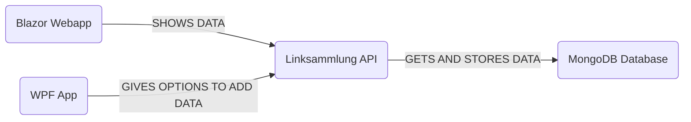

# Linksammlung API 

Dies ist das Semesterprojekt von Janis Papai für den Unterrichtsgegenstand Programmieren und Softwareentwicklung. In diesem Projekt geht es um das Thema REST API's. Eine Anforderung der Lehrpersonen es 2 Clients zu erstellen (in unserem Fall handelt es sich hierbei um eine Website und eine WPF-Anwendung) welche auf die API zugreifen können.

Eines von den Lehrern zur Verfügung gestellten Themen war eine Linksammlung. Für dieses Thema habe ich mich entschieden. Ich nahm mir als Ziel eine einfach zu bedienende Anwendung zur Verfügung zu stellen, welche die Daten, die man eingibt, danach auf der Website anzeigen lassen kann.


## Inhaltsverzeichnis
||- [Softwaredesign](#softwaredesign)|
||- [Beschreibung der Software](#beschreibung-der-software)|
||- [API Beschreibung](#api-beschreibung)|
||- [Diskussion](#diskussion)|

## Softwaredesign




### API

Link_Sammlung ist ein Programm, welches ich in der Entwicklungsumgebung „IntelliJ“ programmiert habe. Es ist auch der wichtigste Teil des gesamten Projektes. Die API ist in Java programmiert und dort werden die Daten verwaltet und auch in eine MongoDb-Datenbank gespeichert.


### WPF

In der WPF-Anwendung kann der Benutzer Daten ganz einfach in die Datenbank speichern/löschen oder bearbeiten. Diese Anwendung ist der Grundstein für die als nächstes beschriebene Website.


### Blazor Webassembly Website

Die Website dient als Anzeige aller gespeicherten Daten somit haben die Benutzer einen klaren Überblick über alle Links welche sie gespeichert haben. Zusätzlich zum Anzeigen der Daten bietet die Website auch noch die Möglichkeit zum Löschen, Bearbeiten und Herunterladen der Daten. Die Website wurde mithilfe von Blazor implementiert.


## Beschreibung der Software

### API

Die API wurde mit Spring Boot umgesetzt.

Einer der wichtigsten Teile der API sind die sogenannten **Endpoints.** Für das Projekt verwendete ich POST, PUT, DELETE und GET.


#### AddLink: 

AddLink stellt den POST-Request da: 
```java
@RequestMapping(method = RequestMethod.POST, value="/addLink")  
public String addLink(@RequestBody Link link) {  
    LinkSammlungService.addLink(link);  
    String response = "{\"success\": true, \"message\": Link has been added successfully.}";  
    return response;  
}
```
Nachdem man einen Link hinzugefügt hat bekommt man einen Response welcher sagt ob der Link erfolgreich in der Datenbank angekommen ist.


#### DeleteLink:
DeleteLink stellt den DELETE-Request da:
```java
@DeleteMapping(value="/deleteLink/{id}")  
public String deleteNotiz(@PathVariable String id) {  
    LinkSammlungService.deleteLink(id);  
    String response = "{\"success\": true, \"message\": Link has been deleted successfully.}";  
    return response;  
}
```


#### EditLink:
EditLink stellt den PUT-Request da: 
```java
@RequestMapping(method = RequestMethod.PUT, value="/editLink/{id}")  
public String editLink(@RequestBody Link link, @PathVariable String id) {  
    LinkSammlungService.editLink(id, link);  
    String response = "{\"success\": true, \"message\": Link has been edited successfully.}";  
    return response;  
}
```

### WPF

Ich habe mich am Anfang des Projektes dazu entschieden, die WPF eher simpel zu halten. Aus diesem Grund gibt es auch keine Möglichkeit die Links, welche man in der WPF speichert zu bearbeiten, da es meiner Meinung nach viel Benutzerfreundlicher ist dies dann auf der Website zu machen, wo man dann auch eine größere Übersicht hat.
In der WPF gibt es jedoch die Möglichkeit Links hinzuzufügen oder zu lösche

Der Code für das Hinzufügen von Links sieht wie folgt aus:

```java

try
{
    HttpClient client = new HttpClient();
	string data = "";
    data = client.GetStringAsync("http://localhost:3002/Link").Result;
	var list = JsonSerializer.Deserialize<List<Link>>(data);
                
    if (list != null)
    {
        link=makeNewLink(link.linkName, link.linkURL, link.erstellung, link.id);
        var noteJson = JsonSerializer.Serialize(link);
	    var requestContent = new StringContent(noteJson, Encoding.UTF8, "application/json");

        var response = client.PostAsync("http://localhost:3002/addLink", requestContent);
    }


    Link link2 = new Link();

    string data2 = "";
    data2 = client.GetStringAsync("http://localhost:3002/Link").Result;
    var list2 = JsonSerializer.Deserialize<List<Link>>(data2);
    link2.id = list2.Last().id;

	linkVarFORID.Add(link2);
}
catch (Exception ex)
{
               
}
```

Zu Beginn des Codes wird durch <code> data = client.getStringAsync </code> eine Verbindung zur API hergestellt und die dort erhaltenen Daten werden dann in ein JSON Objekt umgewandelt.
Als zweiten Schritt erstellen wir einen neuen Link mit seinen Attributen (linkName etc) und dieser wird dann am Ende bei der Zeile <code>var response = client.PostAsync</code> mittels dem POST-Request zu der Datenbank hinzugefügt

Der untere Teil des Codes wird dafür verwendet um die einzelnen ids der Links herrauszufinden und danach in eine Liste zu speichern. Dies brauchen wir dann bei der Delete Methode:

```java
            try
            {
                HttpClient client = new HttpClient();

                string data = "";
                data = client.GetStringAsync("http://localhost:3002/Link").Result;
                var list = JsonSerializer.Deserialize<List<Link>>(data);


                Link link = linkVarFORID[help];
                if (link != null && list != null)
                {
var response = client.DeleteAsync("http://localhost:3002/deleteLink/" + link.id);
                    LinkBoxList.Items.Remove(LinkBoxList.SelectedItem);                  
                }
            }
            catch (Exception ex)
            {

            }
```

In diesem Code wird wie schon bei dem Hinzufügen der Links zuerst eine Verbindung hergestellt und danach der DELETE-Request verwendet,
Es ist wichtig auch immer die id der zu löschenden Links mitzugeben, da man nur somit weiß welchen Link man genau löschen sollte

### Blazor Webassembly Website

Meine Website wurde mit dem Blazor Webframework erstellt, hierbei ist der Zugriff auf die Link_Sammlung API der wichtigste Teil des Codes. Eine Zentrale Function ist der GET-Request an die API um auf die Daten dieser zugreigen zu können.
Die Verbindung ist wie folgt aufgebaut:

```js
		try
        {
            string data = await http.GetStringAsync("http://localhost:3002/Link");
            links = JsonSerializer.Deserialize<List<Linksammlung>>(data);
        }
        catch
        {

        }
    ```

Hier wird der <code>HttpClient http</code> verwendet, welcher bei den includes der Datei mithilfe von @inject definiert wurde. Die Defintion sieht so aus: <code>@inject HttpClient http</code> 

Besonders herrausheben an meinem Code möchte ich die Möglichkeit die Information der gespeicherten Daten als .txt Datei zu downloaden.
Der Code zum Download ist wie folgt aufgebaut:

```js
StringBuilder sb = new StringBuilder();

                //Überschriften der Datei
                sb.AppendLine("Link Name\tLink URL\tErstellung");

                //Reihen für die Tabelle in der Datei
                foreach (var link in links)
                {
                    sb.AppendLine($"{link.linkName}\t\t{link.linkURL}\t{link.erstellung}");
                }

                string tableData = sb.ToString();
                string fileName = $"data_{DateTime.Now:yyyyMMddHHmmss}.txt";

                var element = await JSRuntime.InvokeAsync<IJSObjectReference>("eval", "document.createElement('a')");

                // Set anchor attributes
                await element.InvokeVoidAsync("setAttribute", "href", $"data:text/plain;charset=utf-8,{Uri.EscapeDataString(tableData)}");
                await element.InvokeVoidAsync("setAttribute", "download", fileName);

                //Download der Datei
                await element.InvokeVoidAsync("click");
            }
            catch (Exception ex)
            {
                Console.WriteLine($"An error occurred while downloading data: {ex.Message}");
            }
 ```

Im Schritt 1 werden die links (in denen die Informationen gespeichert sind) in ein JSON Objekt umgewandelt.
Schritt 2 erstellt ein array worin alle json Objekte danach gespeichert werden.
Im Schritt 3 wird einfach der Name des Files definiert (in diesem Fall einfach data_das Datum was heute ist und es wird eine txt-Datei daraus gemacht).
Im letzten Schritt wird der Download ausgelöst und in das File werden die verschiedenen Informationen gegeben.

Ganz wichtig ist hierbei, die neu erstelle Klasse: <code>DownloadFIleScript.razor</code>.
```razor
@inject IJSRuntime JSRuntime

@code {
    protected override async Task OnInitializedAsync()
    {
        await JSRuntime.InvokeVoidAsync("eval", @"
            window.downloadFile = function(fileName, dataBytes) {
                const blob = new Blob([dataBytes], { type: 'application/json' });
                const link = document.createElement('a');
                link.href = URL.createObjectURL(blob);
                link.download = fileName;
                document.body.appendChild(link);
                link.click();
                document.body.removeChild(link);
                URL.revokeObjectURL(link.href);
            };
        ");
    }
}
```

Diese Klasse ist schlussendlich ausschlaggebend für das wirkliche Downloaden der Datei.


## API Beschreibung

<details>

<summary><code>GET</code> <code><b>/Link</b></code> <code>(Gibt alle Links zurück)</code></summary>

##### Parameters

> | data type | type | format | description |
> |----------------|--------------|-------------------------|---------------------------------------------------------------|
> | None | - | - | N/A |

##### Responses

> |content-type | response example / description |

> |-------------------------|-----------------------------------------------------------------------------------------------|

> |`json string` | `JSON Liste an Serien` |

</details>

<details>

<summary><code>GET</code> <code><b>/status</b></code> <code>(Gibt den status der Datenbank zurück --> ist sie erreichbar oder nicht)</code></summary>

##### Parameters

> | data type | type | format | description |

> |----------------|--------------|-------------------------|---------------------------------------------------------------|

> | None | - | - | N/A |

##### Responses

> |content-type | response example / description |

> |-------------------------|-----------------------------------------------------------------------------------------------|

> |`json string` | `JSON Objekt der Serie` |

</details>

<details>


<summary><code>POST</code> <code><b>/addLink</b></code> <code>(Fügt einen Link hinzu)</code></summary>

##### Parameters

> | data type | type | format | description |

> |----------------|--------------|-------------------------|---------------------------------------------------------------|

> | Link | Path | Link | Der Link der hinzugefügt werden soll |

##### Responses

> |content-type | response example / description |

> |-------------------------|-----------------------------------------------------------------------------------------------|

> |`json string` | `{"success":"true","message":" Link has been added successfully"}` |

</details>

<details>

<summary><code>PUT</code> <code><b>/editLink/{id}</b></code> <code>(Updated einen eingetragenen Link)</code></summary>

##### Parameters

> | data type | type | format | description |

> |----------------|--------------|-------------------------|---------------------------------------------------------------|

> | Link | Path | Link | Link den man editieren möchte |
> | String | Path | String | ID des Links |

> | Rennen | Requestbody | object (JSON or YAML) | N/A |

##### Responses

> |content-type | response example / description |

> |-------------------------|-----------------------------------------------------------------------------------------------|

> |`json string` | `{"success":"true","message":"Success Message"}` |

</details>

<details>

<summary><code>DELETE</code> <code><b>/deleteLink/{id}</b></code> <code>(Löscht einen Link in der Sammlung)</code></summary>

##### Parameters

> | data type | type | format | description |

> |----------------|--------------|-------------------------|---------------------------------------------------------------|

> | Link | Path | Link | gewünscjt |

> | String | Path | String | {id} des gewünschten Rennens |

##### Responses

> |content-type | response example / description |

> |-------------------------|----------------------------------------------------------------------------------------------|

> |`json string` | `{"success":"true","message":"Success Message"}` |

</details>

## Diskussion der Ergebnisse

Das Programm wurde erfolgreich erstellt und entspricht den Anforderungen welche einerseits von den Lehrern und mir selbst vorgegeben wurden.
Das Projekt kann in unterschiedliche Programme eingeteilt werden, welche am Ende gemeinsam das System bilden.
Die Funktion des Programms ist die Speicherung von Links welche vom Benutzer eingegeben werden, hierbei wird eine MongoDB als Datenbank verwendet.
Die WPF Anwendung bietet die Möglichkeit Daten in die Datenbank hinzuzufügen und diese auch zu löschen.
Die WebApp wird danach großteils zur Verwaltung der Liste verwendet und bietet eine bessere Übersicht der Einträge für den Benutzer.

Bei der Erarbeitung des Projektes kam es oftmals zu Hürden, welche die Fertigstellung verzögerten. 
Das größte Problem war die Erarbeitung der Website, da dies mein erstes Mal war, dass ich eine Website selbst konstruieren musste.
Zuerst habe ich mich beim Erstellen der Website für React entschieden.
Ich bin aber beim Erlernen von React schnell draufgekommen, dass mir hierfür die Zeit fehlt.
Nachdem ich mit Blazor begonnen habe zu arbeiten, hatte ich keinerlei größere Probleme mehr und konnte ohne große Probleme meine Page erstellen.

Eine auch sehr große und vorher nicht bedachte schwierigkeit war die Tatsache, dass ich 1 Woche vor der Präsentation ein Problem mit meinem Laptop hatte und aus diesem Grund auf einen neuen Umsteigen musste. Dies führte zu schwierigkeiten wie zum Beispiel das Downloaden aller Pakete um schlussendlich das Program so zu zeigen wie ich es eigentlich geplant hatte.
